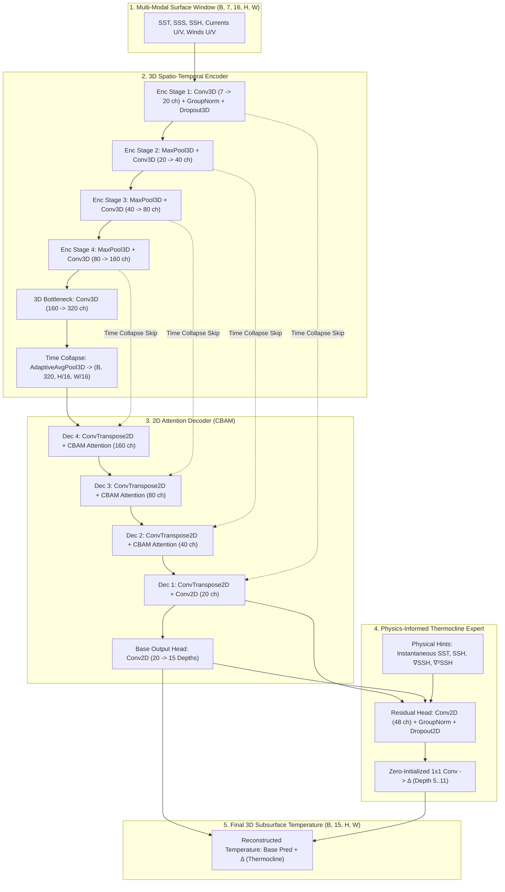

# 🌊 Satellite Embedding-Based Deep Learning Framework for Subsurface Ocean Temperature Reconstruction
 
> **Organization:** Ministry of Earth Sciences (MoES) | Indian National Centre for Ocean Information Services (INCOIS)  
> **Target Domain:** North Indian Ocean (5°N to 30°N, 45°E to 105°E)  
> **Resolution:** 0.25° × 0.25° Spatial Grid | Daily Temporal Resolution  

---

## 📌 Executive Summary

This project presents an end-to-end, physics-informed Deep Learning framework designed to reconstruct **three-dimensional (3D) subsurface ocean temperature profiles** down to 1,000 meters depth using exclusively **2D surface satellite observations**.

Direct subsurface ocean measurements (via ARGO profiling floats and moored buoys) are spatiotemporally sparse. Conversely, surface satellite observations—Sea Surface Temperature (**SST**), Sea Surface Salinity (**SSS**), Sea Surface Height (**SSH/SLA**), Surface Currents (**U, V**), and Surface Winds (**U, V**)—offer continuous high-resolution coverage. The proposed framework harnesses a novel **Hybrid 3D Encoder / 2D Attention Decoder + Thermocline Expert Engine** to learn non-linear latent representations that map surface dynamics (eddy displacement, wind stress curl, thermocline pumping) to the vertical ocean structure.

```
       +-----------------------------------------------------------------------+
       |                         INPUT: Surface Satellite                      |
       |  (SST, SSS, SSH/SLA, Surface Currents U/V, 10m Surface Winds U/V)      |
       |                   16-Day Dynamic Temporal Window                      |
       +-----------------------------------------------------------------------+
                                           |
                                           v
       +-----------------------------------------------------------------------+
       |               STAGE 1: 3D Spatio-Temporal Encoder                     |
       |         4-Stage 3D Conv Net + GroupNorm + 3D Spatial Dropout          |
       |            (Learns dynamic latent satellite embeddings)               |
       +-----------------------------------------------------------------------+
                                           |
                                           v
       +-----------------------------------------------------------------------+
       |           STAGE 2: 2D Attention Decoder (CBAM)                        |
       |     Channel & Spatial Attention + Transposed 2D Convolutions          |
       |        (Generates baseline 15-depth 3D temperature grid)              |
       +-----------------------------------------------------------------------+
                                           |
                                           v
       +-----------------------------------------------------------------------+
       |         STAGE 3: Physics-Informed Thermocline Expert Head            |
       |    Computes SSH Gradient (∇SSH) & Laplacian Curvature (∇²SSH)        |
       |    Predicts zero-initialized residual corrections for 50m-200m depth  |
       +-----------------------------------------------------------------------+
                                           |
                                           v
       +-----------------------------------------------------------------------+
       |                         OUTPUT: 3D Temperature                        |
       |          15 Standard Depth Levels (0m to 1000m) at 0.25° Daily        |
       +-----------------------------------------------------------------------+
```

---

## 🎯 Key Architectural Innovations (Why Proposed Framework is Superior?)

| Innovation | Traditional Machine Learning / Standard 2D CNN | Proposed Deep Learning Framework | Key Advantage |
| :--- | :--- | :--- | :--- |
| **Temporal Context** | Single-day instantaneous snapshot | **16-day dynamic temporal lookback window** | Captures upper-ocean thermal inertia, mesoscale eddy memory, and wind-driven vertical transport. |
| **3D Volumetric Processing** | 2D spatial slice operations | **3D Spatio-Temporal Convolutions (`Conv3d`)** | Preserves temporal phase continuity and vertical structure coupling across time-lags. |
| **Attention Mechanism** | Uniform feature weighting | **Convolutional Block Attention Module (CBAM)** | Dynamically emphasizes critical channels and spatial frontal zones (e.g., Somali current, Bay of Bengal eddies). |
| **Thermocline Specialization** | Single global loss / uniform capacity across depths | **Dedicated Residual Thermocline Expert Head** | Targets the sharp pycnocline layer (50m–200m depth) where 75% of reconstruction error occurs. |
| **Physics-Informed Features** | Purely data-driven black box | **Embedded Sobel SSH Gradients ($\nabla\text{SSH}$) & Laplacian ($\nabla^2\text{SSH}$)** | Explicitly feeds geostrophic velocity shear and eddy curvature physics into the expert head. |
| **Bathymetry Masking** | Static 2D sea/land mask | **Per-Depth Dynamic 3D Masking ($15 \times H \times W$)** | Eliminates false ocean gradients over shallow bathymetry (seafloor) and missing target pixels. |
| **Safety & Non-Regression** | Retraining degrades un-targeted depth levels | **Zero-Initialized Residual Identity Design** | Guarantees mathematically that expert updates ONLY refine thermocline depths while leaving upper/deep layers intact. |

---

## 🏗️ Detailed Deep Learning Model Architecture

The proposed framework adopts a hybrid dual-engine neural architecture (`UNetOceanV2`):



### 1. 3D Spatio-Temporal Encoder (`ConvBlock3D`)
- **Input Array**: Shape `(B, 7, 16, H, W)` where $B$ is batch size, 7 input variables, 16 temporal days, and $(H, W)$ spatial dimensions.
- **3D Convolutions**: Uses kernel size $3 \times 3 \times 3$ with same padding across temporal and spatial dimensions.
- **Group Normalization (`GroupNorm`)**: Replaces standard BatchNorm to ensure stable gradients independent of batch size variations during distributed inference.
- **Spatial 3D Dropout (`Dropout3d`)**: Zeroes out entire 3D feature channels per pass to break spatial autocorrelation between neighboring pixels.

### 2. Time-Collapsed Bottleneck & 2D Decoder with CBAM
- **Time Collapse (`collapse_time`)**: Employs adaptive 3D average pooling across the temporal dimension `AdaptiveAvgPool3d((1, H', W'))`, condensing the 16-day dynamic history into a latent 2D representation while retaining high-level ocean memory.
- **Skip Connections**: Bridge 3D encoder features to 2D decoder stages via time-collapsed feature maps.
- **Convolutional Block Attention Module (CBAM)**:
  1. **Channel Attention**: Aggregates spatial information via parallel Adaptive Average Pooling and Max Pooling, feeding through a shared MLP to highlight inter-variable dependencies (e.g., wind stress vs. SLA correlation).
  2. **Spatial Attention**: Concatenates channel-averaged and channel-maximized feature maps, passing through a $7 \times 7$ spatial kernel to locate energetic front lines, thermocline steepening, and mesoscale eddies.

### 3. Dedicated Thermocline Expert Engine (`ThermoclineExpert`)
- **Physical Motivation**: The thermocline zone (50m to 200m; depth indices 5 to 11) accounts for ~75% of the total vertical mean squared error due to internal wave dynamics and steep vertical temperature gradients.
- **Physics-Informed Input Signals**:
  - **Instantaneous SST & SSH**: Surface boundary condition & sea surface height anomaly.
  - **Sobel Spatial Derivatives ($\nabla\text{SSH}_x, \nabla\text{SSH}_y$)**: Exact geostrophic current shear hints computed via fixed Sobel filters.
  - **Laplacian Curvature ($\nabla^2\text{SSH}$)**: Fixed Laplacian filter measuring cyclonic/anticyclonic eddy centers and pycnocline displacement.
- **Zero-Initialization Residual Architecture**:
  - The final layer is a $1 \times 1$ convolution initialized with zero weights and zero biases ($\text{weight} = 0, \text{bias} = 0$).
  - At step 0 of expert training, $\Delta T_{\text{thermocline}} = 0$, making the model output **100% identical to the base checkpoint**.
  - Training strictly optimizes residual additions $\Delta T$, ensuring zero regression risk for surface and deep ocean layers.

---

## 📊 Dataset Specifications & Data Harmonization

### Input Variables (Surface Satellite Observations)
All surface data products are regridded to **0.25° × 0.25° resolution** at **daily** intervals across the North Indian Ocean domain (5°N–30°N, 45°E–105°E).

| Variable | Description | Source / Satellite Product | Units | Channel Index |
| :--- | :--- | :--- | :--- | :--- |
| **SST** | Sea Surface Temperature | OSTIA (0.05° interpolated to 0.25°) | K / °C | 0 |
| **SSS** | Sea Surface Salinity | SMAP / SMOS (0.125° interpolated to 0.25°) | PSU | 1 |
| **SSH / SLA** | Sea Level Anomaly / Height | DUACS Altimetry (0.25°) | meters | 2 |
| **U Current** | Eastward Surface Velocity | OSCAR L4 / Satellite Altimetry Current | m/s | 3 |
| **V Current** | Northward Surface Velocity | OSCAR L4 / Satellite Altimetry Current | m/s | 4 |
| **U Wind** | Eastward 10m Surface Wind | ASCAT / CCMP Vector Wind (0.25°) | m/s | 5 |
| **V Wind** | Northward 10m Surface Wind | ASCAT / CCMP Vector Wind (0.25°) | m/s | 6 |

### Target Variables (Subsurface Temperature Depths)
Reconstructed from **GLORYS12V1 Global Ocean Reanalysis** and validated against **INCOIS Live Access Server (LAS) Gridded ARGO Profiling Floats**.

- **15 Standard Depth Levels (meters)**:  
  `[0m, 5m, 10m, 20m, 30m, 50m, 75m, 100m, 125m, 150m, 200m, 300m, 500m, 700m, 1000m]`

### Dynamic Per-Depth Bathymetry Masking
Unlike simplistic models that use a flat 2D land/sea mask across all depths, the framework computes a **3D Per-Depth Loss Mask (`valid_mask`)**:
$$\text{Mask}(d, y, x) = \neg \text{isnan}(\text{Target}(d, y, x)) \land \text{StaticOceanMask}(y, x)$$
This prevents shallow seafloor areas (bathymetry) or missing data pixels from injecting zero-padded synthetic gradients during training.

---

## 🚀 Optimization, Acceleration & Augmentation

1. **GPU-Accelerated Vectorized Augmentation (`augment_batch`)**:
   - **Spatial Mirroring**: Random longitude flip ($p = 0.5$) executed entirely on GPU. Automatically flips vector signs for zonal currents ($U_{\text{current}}$) and zonal winds ($U_{\text{wind}}$).
   - **Gaussian Noise Injection**: Adds $\mathcal{N}(0, 0.03)$ jitter to input features during training to prevent over-fitting.
2. **Precision & Speed Tuning**:
   - **BFloat16 Mixed Precision (`torch.amp.autocast`)**: Full TensorCore utilization on NVIDIA A100/H100 GPUs without requiring dynamic loss scaling.
   - **Kernel Fusion (`torch.compile`)**: Fuses sequential Conv-Norm-Activation chains into unified GPU kernels.
   - **TensorFloat-32 (TF32)**: Explicitly enabled for matrix multiplication and 3D convolutions.
3. **Loss Formulation & Targeted Weighting**:
   - **Masked MSE Loss**:
     $$\mathcal{L}_{\text{MSE}} = \frac{\sum_{b, d, y, x} (\hat{T}_{b,d,y,x} - T_{b,d,y,x})^2 \cdot w_d \cdot M_{b,d,y,x}}{\sum_{b, d, y, x} M_{b,d,y,x} + \epsilon}$$
   - **Targeted Depth Weighting ($w_d$)**: Peak thermocline depths (75m–125m) receive up to **2.4× loss weighting** in the thermocline expert phase to prioritize high-error strata.

---

## 📈 Model Performance & Experimental Results

The model performance is evaluated across 15 standard ocean depths using validation data (1993–2021) and independent **ARGO profiling float observations** (2022–2023).

### 1. Overall Model Performance Metrics

| Architecture Stage | Overall Val RMSE (°C) | Thermocline Band Mean RMSE (°C) | Key Impact |
| :--- | :--- | :--- | :--- |
| **Base 3D U-Net Model (`UNetOcean3D`)** | **0.6816 °C** | **0.8749 °C** | Baseline 3D spatiotemporal reconstruction across all 15 depth levels |
| **Base + Targeted Thermocline Expert (`UNetOceanV2`)** | **0.6762 °C** | **0.8654 °C** | **Targeted improvement** focused on 50m–200m pycnocline layer |

### 2. Thermocline Band Depth-Wise Breakdown (50m to 300m)

The thermocline zone (50m to 200m) carries ~75% of total vertical temperature variance due to sharp pycnocline gradients. The dedicated **Thermocline Expert Engine** applies physics-informed features ($\nabla\text{SSH}, \nabla^2\text{SSH}$) and targeted depth weighting ($1.1\times - 2.4\times$) to achieve consistent error reduction across all thermocline depths:

| Depth Level | Depth (m) | Base Model RMSE (°C) | Base + Expert RMSE (°C) | Delta Improvement (°C) | Targeted Loss Weight |
| :--- | :--- | :--- | :--- | :--- | :--- |
| **Index 5** | 50m | 0.7511 °C | 0.7418 °C | **-0.0093 °C** | 1.3× |
| **Index 6** | 75m | 0.9689 °C | 0.9658 °C | **-0.0031 °C** | 1.9× |
| **Index 7** | 100m | 1.0892 °C | 1.0836 °C | **-0.0056 °C** | 2.4× (Peak Gradient) |
| **Index 8** | 125m | 1.0820 °C | 1.0716 °C | **-0.0104 °C** | 2.4× (Peak Gradient) |
| **Index 9** | 150m | 0.9716 °C | 0.9619 °C | **-0.0097 °C** | 2.2× |
| **Index 10** | 200m | 0.7187 °C | 0.7078 °C | **-0.0109 °C** | 1.4× |
| **Index 11** | 300m | 0.4929 °C | 0.4868 °C | **-0.0061 °C** | 1.1× |

> [!NOTE]
> Because of the **Zero-Initialized Residual Identity Design**, depths outside the thermocline band (surface 0m–30m and deep 500m–1000m) maintain exact parity with the base model, eliminating any risk of performance regression on un-targeted layers.

---

## 📁 Repository Structure

```
model-code/
├── dataset.py                      # Custom PyTorch Dataset with dynamic 3D bathymetry mask & date splits
├── model.py                        # 3D U-Net Architecture (UNetOcean3D with CBAM & spatial dropout)
├── thermocline_expert_model.py     # UNetOceanV2 + Physics-Informed Thermocline Expert engine
├── train.py                        # Base model training pipeline (bf16, torch.compile, GPU augmentation)
├── train_thermocline.py            # Targeted Thermocline Expert training pipeline
├── per_depth_eval.py               # Depth-wise evaluation script (RMSE vs natural std)
├── per_depth_thermocline.py        # Comparative per-depth evaluation for expert model
├── merge_inputs.py                 # Multi-source satellite dataset harmonization & interpolation
├── merge_glorys.py                 # GLORYS target dataset extraction & 3D array assembly
├── merge_glorys_with_inputs.py     # Unified HDF5 dataset builder
├── build_argo_test.py              # Independent ARGO test benchmark builder (2022-2023)
└── README.md                       # Master Documentation & Presentation Guide
```

---

## 🛠️ Usage Instructions

### 1. Data Harmonization & Preprocessing
To merge raw OSTIA, SMAP, DUACS, OSCAR, and CCMP datasets into standard 0.25° grid files:
```bash
python3 merge_inputs.py
python3 merge_glorys.py
python3 merge_glorys_with_inputs.py
```

### 2. Base Model Training
Train the 16-day 3D Encoder/2D Decoder U-Net backbone:
```bash
python3 train.py
```

### 3. Thermocline Expert Fine-Tuning
Train the zero-initialized thermocline expert head on top of the frozen base model:
```bash
python3 train_thermocline.py
```

### 4. Per-Depth Metric Evaluation
Evaluate per-depth RMSE (°C) and benchmark against target natural standard deviation:
```bash
python3 per_depth_eval.py
python3 per_depth_thermocline.py
```

---

<p align="center">
  <b>Developed for Ministry of Earth Sciences (MoES) & INCOIS | Satellite Embedding-Based Deep Learning Framework</b>
</p>
